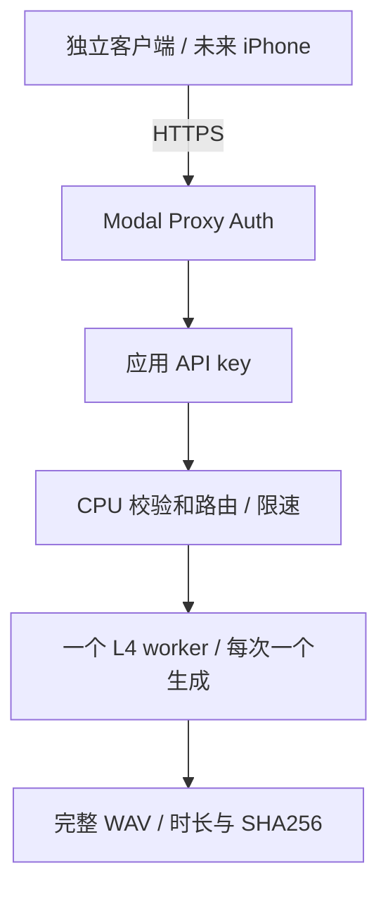

# AudioRelayLab：Modal 迁移实现与部署记录

## 当前 1.6.3 / build 13

预设指令编辑能力已部署：health.capabilities.presetInstruction=true；四个 CustomVoice 预设声明 supportsInstruction=true。POST /v1/tts 与 POST /v1/jobs 的 preset 可传 instruction；省略用默认、空串清除、原文最多 500 字符。两种固定参考预设拒绝覆盖，任务去重包含实际指令并保留预设身份。同步接口、九个自定义 speaker、任务 ID 与既有连接 JSON 保持兼容。

本轮四次真实 L4 生成、安全检查、同 ID 去重与不同指令冲突、固定参考校验及最终缩零通过，见 [1.6.3 测试报告](REVOICE-1.6.3-TEST-REPORT-ZH.md)。模型/参考/snapshot 不变；前台直取和后台下载切换由 App 处理，查询/下载不唤醒 GPU。

## 1.6.1 部署与历史证据

GPU worker、CPU API、任务执行与下载服务的 `scaledown_window` 已改为 **75 秒并部署**；模型准备与每小时清理任务保持 10 秒。继续单一 L4 池、min=0/max=1/buffer=0、生成并发 1，snapshot 开启，模型、固定参考及推理算法未改变。本文下方 60/120 秒和未提交的描述属于早期历史记录。

新增 `POST /v1/jobs` 与 `GET /v1/jobs/{id}`，使用 Modal spawn 独立完成任务、Dict 持久状态及 requestID 去重、私有 results Volume 保存 24 小时成品。下载源 `https://your-workspace--audiorelaylab-qwen-download.modal.run` 只接受对应任务的临时只读凭据，查询和下载不启动 GPU；单次下载等待上限 120 秒与空闲缩零窗口分别设置。iOS 使用持久后台 URLSession 取回并校验保存，已有连接 JSON 继续可用。

75 秒配置下三条真实 L4 任务、断开提交连接后完成、去重/冲突、CustomVoice/Base 切换、约 60 秒后同 session 复用、最终缩零及查询/下载不唤醒 GPU 均通过。完整证据与当前 IPA 交付见 [1.6.1 测试报告](REVOICE-1.6.1-TEST-REPORT-ZH.md)。main 尚未合并，等待用户签名验收。

重部署保持现有 snapshot 时明确使用 `setup_modal_cloud.py --gpu-snapshot on`，不传开关默认为 off。

## 1.6.0 / build 10 历史增量

App 从 `feature/revoice-ios-1.6.0` 接入云端；手机强制设备端识别，云端只接收文字和目标声线参数。新增 `/v1/speakers` 与 `/v1/tts/custom`，九个固定 speaker 白名单，instruction 可空、原样传递、最多 500 字符；语言 Auto。原 `/v1/tts` 仍只接受 voice/text，六个认可预设的 instruction、Chinese 参数和两组固定参考保持原值。健康接口公开能力及长度限制。

GPU worker 与常规 CPU API 的空闲窗口为 120 秒；模型准备保持 10 秒。继续单一 L4 池、min=0/max=1/buffer=0、生成并发 1。模型切换先释放上一模型并把缓存参考 prompt 移至 CPU，再核验 Volume 文件哈希并加载新模型。

Snapshot 是可关闭的部署开关：`setup_modal_cloud.py --gpu-snapshot on|off`，默认 off。捕获前核验依赖与资产、计算两组固定参考、释放 Base、加载并预热 CustomVoice，始终只有一个模型驻留；恢复重置 session ID、生成计数及运行状态。A/B 串行部署到同一 App，最多 16 次冷启动请求；只有两种模型的中位数均降低至少 30%，且恢复/切换/输出检查通过，才选择 on。报告保存于 `dist/modal-snapshot-1.6.0/snapshot-report.json`，真实 A/B 已完成，最终启用 snapshot：CustomVoice 中位数降低 63.3%，Base 降低 48.4%。完整捕获/恢复、显存和费用证据见 [SNAPSHOT-REPORT-ZH.md](SNAPSHOT-REPORT-ZH.md)。

当前日常重部署使用 `setup_modal_cloud.py --gpu-snapshot on`，需要关闭时明确指定 `off`。不传开关的引导默认为 off。

本轮 Python 72 项回归与实际模拟器 179 项 XCTest 全部通过，iPhoneOS Release 及无签名 build 10 已生成，Swift 警告 0；六个预设、九个 speaker 的真实 L4 验证和最终缩零通过。源码与 IPA 不包含凭据；连接 JSON 由用户导入手机 Keychain。安装与使用见 [REVOICE-1.6-ZH.md](REVOICE-1.6-ZH.md)。

## 上一轮独立后端的历史验收记录

2026-10-03（纽约时间）。**已完成部署、本地回归和真实 Modal NVIDIA L4 验收。** 浏览器登录及本轮部署授权已完成；8 条短句覆盖全部 6 个正式候选，双层认证、非法输入不启动 GPU、冷暖启动、两次缩至零与再次冷启动均通过。全部 10 组本地 preset 保留，App 未切换后端，未 commit 或 push。

原始实测证据为 [report.json](dist/modal-smoke-verified/report.json)，8 个 WAV 和 [离线试听页](dist/modal-smoke-verified/Modal-L4-云端试听.html) 已保存。账户 billable cost 目前为 $0；页面中的 credits 余额和预算设置未能读取，需要用户核对，详见费用段。

## 架构及资源配置



普通 Modal App 名称为 `audiorelaylab-qwen`，不是 Shared Endpoint。App ID 为 `ap-j1iV5hEnYCBKyz5f6uO6TP`，管理页为 [本项目 App](https://modal.com/id/ap-j1iV5hEnYCBKyz5f6uO6TP)，受保护 Endpoint 为 `https://your-workspace--audiorelaylab-qwen-api.modal.run`。客户端凭据已存入 gitignore 的 `server/.private/modal-client.json`，资源归属和通过状态存入 `server/.private/modal-deployment-state.json`。

GPU 明确为 `gpu="L4"`，不指定 region、cloud、non-preemptible 或其他 GPU fallback。GPU worker 使用 `min_containers=0 / max_containers=1 / buffer_containers=0 / scaledown_window=60`，`modal.concurrent(max_inputs=1)`；CPU API 是单个容器，最多 16 个并发 HTTP 输入，应用层同时只放行一条生成，其余返回 429。真实运行日志确认 `NVIDIA L4`（标称 24 GB，CUDA 可见总容量 23,659,151,360 bytes）；生成期间观察到池中仅 1 个 runner、1 个 active input，测试结束再次查询为 0。

两个模型逻辑分支共用**一个不带参数的 GPU class**。这是为严格满足“最多一块 L4”：Modal 的容器上限按 Function/参数池生效，两个独立 class 各设 max=1 仍可能同时有两块空闲 L4。本实现切换 variant 时先释放模型、收集垃圾并清空 CUDA cache，然后加载下一模型；每个容器始终仅保留一套 1.7B 权重。Base 的固定参考提示缓存保留为 CPU tensor，切回 Base 时复用。重部署使用 `strategy="recreate"`，避免 rolling 更新产生新旧 GPU 池重叠。[Modal 扩缩容说明](https://modal.com/docs/guide/scale)

## Working tree 的真实预设清单

起始 HEAD 为 `ddcac1e0e4ee41673893e262b5dedf6fe1d1660f`。起始 tracked working tree 无修改，另有用户原始 `HANDOFF-ZH.md` 未追踪，保持原样。实际找到 10 组当前预设，完整定义继续来自 `server/revoice-palette.json` 和 `server/revoice-audition-cases.json`，没有从远端覆盖本地。

试听反馈已记录到 `server/revoice-review.json`。6 组 `keep` 作为本轮云端可调用候选；其余 4 组保留本地入口、配置、参考和音频，不删除或默认为已认可。

| preset ID | 显示名 | variant / 固定身份 | 基础 instruction 来源 | 试听结果 / 云端 |
|---|---|---|---|---|
| serena-original | Serena · 认可原版 | CustomVoice / Serena | cases.customInstruction 原样 | keep / 开放 |
| vivian-original | Vivian · 认可原版 | CustomVoice / Vivian | cases.customInstruction 原样 | keep / 开放 |
| ancient-dylan | 古风温润小生 | CustomVoice / Dylan | 本 preset.instruction 原样 | keep / 开放 |
| scholar-design | 清润书生 | Base / 固定书生参考 | 无每日 VoiceDesign 指令；参考身份固定 | keep / 开放 |
| cute-serena | 可爱萝莉系 · Serena | CustomVoice / Serena | 本 preset.instruction 原样 | unreviewed / 本地保留 |
| cute-design | 清脆动漫可爱声 | Base / 固定可爱参考 | 无每日 VoiceDesign 指令；参考身份固定 | keep / 开放 |
| lazy-vivian | 懒洋洋 · Vivian | CustomVoice / Vivian | 本 preset.instruction 原样 | adjust / 本地保留 |
| lazy-design | 午后慵懒女声 | Base / 固定慵懒参考 | 无每日 VoiceDesign 指令；参考身份固定 | unreviewed / 本地保留 |
| cool-serena | 清冷淡然 · Serena | CustomVoice / Serena | 本 preset.instruction 原样 | keep / 开放 |
| magnetic-uncle | 磁性温厚男声 | CustomVoice / Uncle_Fu | 本 preset.instruction 原样 | reject / 本地保留 |

完整 inventory（含实际完整 instruction、speaker、参考 ID、Base/CustomVoice/runtime flags）由 `PresetRegistry.inventory()` 自动导出，见 [preset-inventory.json](dist/modal-preflight/preset-inventory.json)。10 组都不需要 VoiceDesign runtime。更早的 `Designed` 首轮废稿不属于这 10 组，旧 CLI、参考和音频仍保留，不进入云端 registry。

## 模型与依赖

实际部署的 runtime 仅使用以下两个 1.7B variant；八条真实 GPU 日志中的 repository、revision 和主权重 SHA 均与锁文件匹配：

| variant | repository | 固定 revision |
|---|---|---|
| custom | Qwen/Qwen3-TTS-12Hz-1.7B-CustomVoice | 0c0e3051f131929182e2c023b9537f8b1c68adfe |
| base | Qwen/Qwen3-TTS-12Hz-1.7B-Base | fd4b254389122332181a7c3db7f27e918eec64e3 |

模型事实来源为原 `server/revoice-lock.json`，文件和 revision 未修改。VoiceDesign 的历史 revision 仅用来核对固定参考元数据，不下载 VoiceDesign/ASR 权重到 Modal，也不重新设计声音。云端使用 PyTorch 2.5.1+cu124、NumPy 1.26.4、Qwen 0.1.1、BF16、SDPA 与 `torch.inference_mode()`。

最新稳定 Modal SDK 已通过实时 PyPI 元数据确认并独立安装为 **1.6.1**。HTTP 依赖固定在 `modal-requirements.txt`；48 个推理依赖的实际版本从本机已验证环境提取到 `modal-inference-requirements.txt`。Torch/torchaudio 从 cu124 官方索引安装，其 Linux CUDA 依赖由该固定 wheel 锁定；不安装未使用的 Gradio CLI 和 HF-Xet 下载加速器。原环境没有升级。

公共权重准备选择私有 Volume `audiorelaylab-qwen-assets`。两个 variant 的逻辑文件体积约 9.06 GB，初始化 CPU 函数按锁文件逐个下载、核验，按 SHA 缓存去重，硬链接不支持时复制。正常 API 不调用此初始化函数；GPU 运行时网络被禁用，并且 `HF_HUB_OFFLINE=1 / TRANSFORMERS_OFFLINE=1 / local_files_only=True`。冷启动再次验证所需模型文件大小和 SHA-256，缺失或变化时失败，不临时下载。[模型权重存储建议](https://modal.com/docs/guide/model-weights)

固定参考使用原 `dist/revoice-expanded` WAV 与 JSON。`revoice-references.json` 仅保存文件名、音频/metadata/文字哈希。上传前和云端启动后核验 WAV、metadata、参考文字及设计模型 revision；只有两组已认可设计参考上传私有 Volume，参考 WAV 和完整 metadata 不进 Image 源码层或 Git。Base 提示每个参考在容器第一次加载 Base 时计算一次，后续复用。

## 安全及 HTTP 行为

外层 `modal.asgi_app(requires_proxy_auth=True)`；内层 Modal Secret 名称 `audiorelaylab-api-prod`，变量为 `AUDIOLAB_API_KEY`，高熵值由 `secrets.token_urlsafe(48)` 创建。Proxy Token 专用名称为 `audiorelaylab-ios-prod`。客户端使用 `Modal-Key / Modal-Secret` 和 `X-AudioRelay-Key`。本文和源码不包含这些值。[Proxy Auth](https://modal.com/docs/guide/webhook-proxy-auth)

应用 key 用 `hmac.compare_digest()` 校验；缺失或短于 32 字符时 API 启动失败。认证先于 body、预设与限速检查，最后才调用 GPU。仅接受 `voice / text`，拒绝未知和重复 JSON 字段；8 KiB 请求体限制覆盖 Content-Length 与流式输入；文字非空、最多 1000 字符，拒绝无效 Unicode/control characters。客户端不能提供 speaker、模型、设备、文件路径、参考 URL 或动态 instruction。API 不上传原始录音，没有 LLM 情绪导演。

`/v1/voices` 只公开 id/displayName/variant；`/v1/health` 不调用 GPU。关闭 `/docs /redoc /openapi.json`，不配置 CORS，返回 `Cache-Control: no-store`。错误仅返回通用消息与 requestID。生产日志只输出 requestID、预设、字符数、variant、耗时、时长和内部运行审计指标，不输出用户完整文字、原始参考、密钥或 Authorization。

原本的 2300 token 截断检测、180 秒独立输出上限、非静音/NaN/Inf 检查、峰值降至 .98 和 WAV SHA 保留为本地与云端共享检查。输出不对齐原录音时长；成品完整校验后才保存，客户端不覆盖已有文件。

单 CPU 容器还限制为每分钟最多 12 次、每小时最多 180 次生成，以及一个 active generation。该轻量窗口在 CPU 容器重启后会重置，**不是持久的月度消费限额**；最终费用保护需 Workspace budget/spend limit。客户端不自动重新生成失败请求，长 HTTP 请求只跟随同 HTTPS origin 的 Modal 303 结果跳转，防止凭据发往其他站点。[Modal 请求超时规则](https://modal.com/docs/guide/webhook-timeouts)

## 本地与真实云端验收

- 本地 Python 回归及新增测试：**61 项全部通过（原有 39 项 + 新增 22 项），无删除或 skip**。新增测试覆盖身份、认证、路由、输入、文件校验、错误恢复、模型生命周期和客户端防泄露；已保存的完整执行记录为 `dist/modal-preflight/python-tests.log`，最终复跑也全部通过（8.258 秒）。
- 真实本机 RTX 4070 GPU：新共享引擎重新生成 Serena 和清润书生的共同聊天句，与已认可历史样本 **SHA-256 完全一致**。Serena 7.20 秒，生成 13.95 秒；书生 6.64 秒，生成 12.17 秒。峰值约 4.40 GiB；这不是 L4 证据。原服务自动恢复并保持六个旧正式音色。
- 模型/参考输入保持锁定，三个现有参考及 sidecar 哈希均核验。`dist/modal-preflight/local-equivalence.json` 保存真实本地证据。
- Modal 真实日志确认 NVIDIA L4、BF16、SDPA、固定 speaker/reference、1.7B revision/hash、单模型驻留和离线资产核验。
- 六个正式候选全部生成成功，八条 WAV 均验证 24 kHz、单声道、PCM 16-bit、正时长、非静音、完整帧数和 SHA-256。PCM 16-bit 样本为有限整数；模型输出在编码前也核验 NaN/Inf。
- 无 Proxy、错误 Proxy 分别返回 401；错误应用 key 返回 403；未知 voice、空 text、1001 字 text 均返回 400。前后 GPU 池均为 0，非法请求未启动 GPU。
- 认证后的 health/voices 均通过，云端预设清单与本地 keep 清单一致；不公开路径、参考或密钥。

| 实测项目 | 请求总耗时 | 纯生成时间 | 音频时长 |
|---|---:|---:|---:|
| Serena 首次冷启动 | 64.67 秒 | 7.44 秒 | 2.88 秒 |
| Serena 同容器 warm | 5.78 秒 | 5.22 秒 | 2.40 秒 |
| Vivian | 10.50 秒 | 9.77 秒 | 4.48 秒 |
| 古风温润小生 | 4.43 秒 | 4.02 秒 | 1.84 秒 |
| 清冷淡然 Serena | 5.53 秒 | 5.02 秒 | 2.32 秒 |
| 清润书生 / 首次切换到 Base | 37.57 秒 | 6.33 秒 | 2.88 秒 |
| 清脆动漫可爱声 / Base 复用 | 5.90 秒 | 5.45 秒 | 2.48 秒 |
| 缩至零后的 Serena 第二次冷启动 | 59.80 秒 | 5.61 秒 | 2.08 秒 |

第一次 warm 与 cold 的 worker session 相同，warm modelLoadSeconds=0；第二次 cold 是不同 session、generationNumber=1。所有 cold/warm 都从已核验的 Volume 本地文件加载，GPU 网络禁用，不重新从 Hugging Face 下载权重。

记录到的 CUDA **生成阶段峰值为 4.2946 GiB**；本轮 RTX 4070 本地相同引擎记录约 4.40 GiB，此前历史约 4.65 GiB。样本文字、硬件不同，不能直接当性能 benchmark。峰值在模型加载完成后 reset，未覆盖加载或固定参考提示构建阶段。

`scaledown_window` 配置为 60 秒；停止生成后实际查询到 GPU 池为 0 分别用时 **101.03 秒、95.67 秒**（包含控制面终止与查询延迟），并非严格 60 秒的关机承诺。两次最终 stats 均为 runners=0 / running inputs=0 / backlog=0；最后一次之后没有新增生成。

首轮 smoke 在启动 GPU 前暴露 SDK 不接受 `Function.from_name("QwenWorker.*")` 的查询写法，已改为公共 `Cls.from_name(... )().synthesize.get_current_stats()`，保留首轮失败记录，并完整重跑成功。没有关闭认证、换 GPU 或跳过失败项。

`smoke_modal_cloud.py` 已完成实际 HTTP + SDK smoke：先无 GPU 的负向认证/输入测试，再默认短句、同容器 warm、其余 5 组短句；确认 L4 runtime 日志和固定参考，等待超过 scaledown window 并查询 GPU pool 为 0，再执行一次第二冷启动并再次等待缩到 0。总计 8 次短生成；原始报告和 WAV 保留在 `dist/modal-smoke-verified`，没有长句压力测试或多 GPU benchmark。

## 登录、部署、客户端和运维

当前电脑已登录并完成部署，无需重复授权。在另一台电脑恢复时，先完成浏览器授权（标准 Modal 配置在用户目录，不要把 token 发到聊天）：

```powershell
.\server\.runtime\modal\venv\Scripts\python.exe -m modal token new
.\server\.runtime\modal\venv\Scripts\python.exe -X utf8 server/setup_modal_cloud.py --check-auth
```

以后重部署时，引导先核实同名 App/Secret/Proxy Token 和本机归属记录，不覆盖其他项目；复用私有参考、Image 和锁定模型缓存。确需重跑 smoke 时必须使用新的输出目录：

```powershell
.\server\.runtime\modal\venv\Scripts\python.exe -X utf8 server/setup_modal_cloud.py
.\server\.runtime\modal\venv\Scripts\python.exe -u -X utf8 server/smoke_modal_cloud.py --output-dir dist/modal-smoke-next
```

测试单句，输出必须为新路径：

```powershell
.\server\.runtime\modal\venv\Scripts\python.exe -X utf8 server/modal_client.py --voice serena-original --text '你好，这是测试。' --output dist/modal-client-test.wav
```

客户端从环境变量或 `server/.private/modal-client.json` 读取 URL 与认证，不 hard-code。本地 recording → CPU ASR → Qwen CLI 继续保留；旧 `Serena / Vivian / Designed` 参数仍有效，现在也接受 10 个 registry preset ID。例如 `--voice scholar-design` 使用原固定参考。

重部署继续使用 `setup_modal_cloud.py` 的 recreate 策略。停止本项目时先从私有部署状态确认 App ID，再在 Modal dashboard 停止该 App，或运行 `python -m modal app stop <该项目 App ID>`；不删除其他项目资源。私有 Volume 默认保留用于后续恢复，停止 App 后不会自动清空固定身份。

查看日志使用 dashboard 或 `python -m modal app logs <该项目 App ID>`。查看用量使用 dashboard **Usage & Billing** 或 `python -m modal billing summary / rates`；脚本在真实 smoke 结束后也读取 workspace summary/rates，报告不包含凭据。

Proxy rotation：在 Settings → Proxy Tokens 新建本项目替换 token，更新本机客户端并验证，再撤销/删除旧 token。应用 key rotation：生成新的 48-byte 熵值，更新本项目 Modal Secret、本机客户端，recreate 部署使旧容器停止，验证新 key 生效和旧 key 被拒绝。不要把 token/key 粘贴到 README、源码、fixture 或 Git。未来 iOS 接入时写 Keychain，不编译进 App。

## 费用与预算

官方 L4 基础价约 **$0.80/GPU 小时**，实际账户 `billing.rates()` 返回 `gpu_hour_cost_l4=0.80000`；另有 CPU/内存费用，启动、模型加载和实际 idle 也计费。Starter 官方提供 $30/月 compute，Volume 含 1 TiB 免费；计划信息与实际余额是不同数据。使用普通 compute，没有 Shared Endpoint、常驻 GPU、固定 region、non-preemptible，也没有升级或购买 credits。[官方价格](https://modal.com/pricing)

开始前实际账单 metered_cost 为 $0。smoke 完成时账单查询约 **metered_cost=$0.13108350，credits adjustment=-$0.13，egress allowance=-$0.00108350，billed_cost=$0**；结束前再次读取计量为 $0.13108351、应付仍为 $0，GPU 池仍为 0。这包含本轮初始化和测试；账单统计可能延迟，不能把当前 $0 当作今后绝不会收费。原始前后账单保存在 `dist/modal-preflight/billing-before.json / billing-after.json` 和 cloud report。

在本工作区 [Usage & Billing](https://modal.com/settings/usage) 设置 Workspace budget/usage limit 为账户本月适用 compute credits 范围，同时将 net spend limit 设为 $0（账户 UI 若允许）；检查工作区其他项目也会共同消耗预算。Workspace budget 是抵扣前 usage cap，spend limit 是抵扣后的现金 cap。Starter 的 Environment budget 不可用，无需为本项目升级；保留 Workspace 级限制即可。[预算和 spend limit](https://modal.com/docs/guide/budgets)

账户 SDK 只提供 summary/report/rates，不返回预算上限或未消耗 credits 余额。浏览器读取工具两次启动失败，因此**当前预算/余额未核实，也未更改预算**；需要用户在本工作区 Usage & Billing 页核对和设置。没有由此阻断已授权的约 $0.13 smoke，也没有假称已启用现金硬上限。

## 本轮文件与 Git 状态

新增 `server/modal_app.py / modal_engine.py / modal_api.py / modal_client.py / setup_modal_cloud.py / smoke_modal_cloud.py`、共享 `revoice_registry.py / revoice_audio.py`、审核/参考清单与固定依赖文件、`tests/test_modal_revoice.py` 及本文。仅对 `revoice_worker.py / evaluate_revoice.py` 做共享检查与新增 preset ID 入口的增量修改；保留旧方式和本地权重、录音/ASR路径。App 项目、版本、正式旧服务、上一轮试听音频未改动。

全部源码改动保留未提交，未 staged、未 commit、未 push；用户原 `HANDOFF-ZH.md` 保留。本轮真实云端验收已完成，代码继续以 `git status / git diff` 供用户审阅。

最终安全审计扫描全部 tracked 文件及未追踪的新文件，共 171 个，未发现真实凭据、连接密钥、私有 reference WAV 泄露；同时对新生成的 Modal/Proxy/API 凭据逐值匹配源码和实际云端日志，均无命中。云端日志没有完整用户测试文字或固定参考文字；云端两组参考 WAV/metadata 的 SHA 再次验证通过。暂存区为空，HEAD 未变化；`git grep` 无凭据命中、`git diff --check` 通过。审计结果保存为 `dist/modal-preflight/security-audit.json`，实际私有配置文件没有加入 Git。

本地旧服务的六个正式音色仍可访问，10 组 preset / 41 条试听文件校验通过。新增离线云端试听页也在桌面 1100px 与手机 390px 验证，八条音频时长匹配，零外部请求、零页面错误；截图与 `page-check.json` 保存在 `dist/modal-smoke-verified`。包括未追踪新源码的完整审阅补丁为 [implementation.patch](dist/modal-preflight/implementation.patch)，未将新文件加入暂存区。
